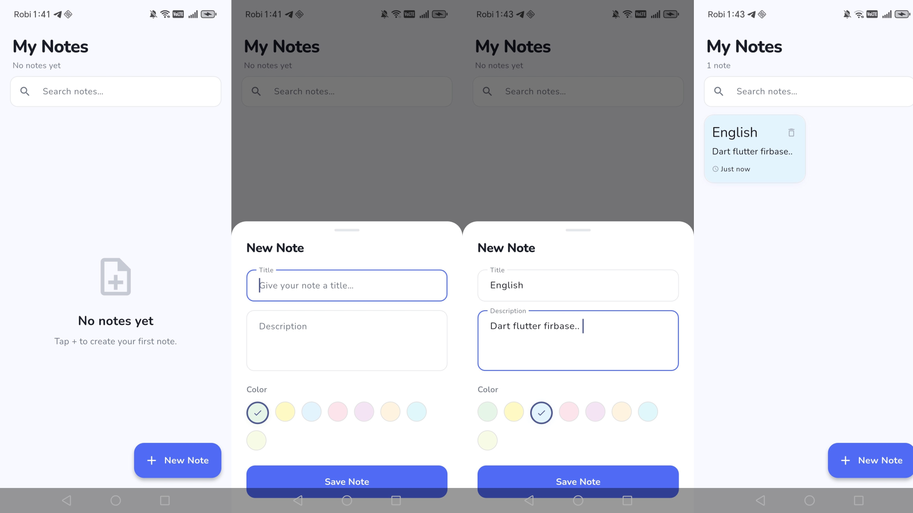
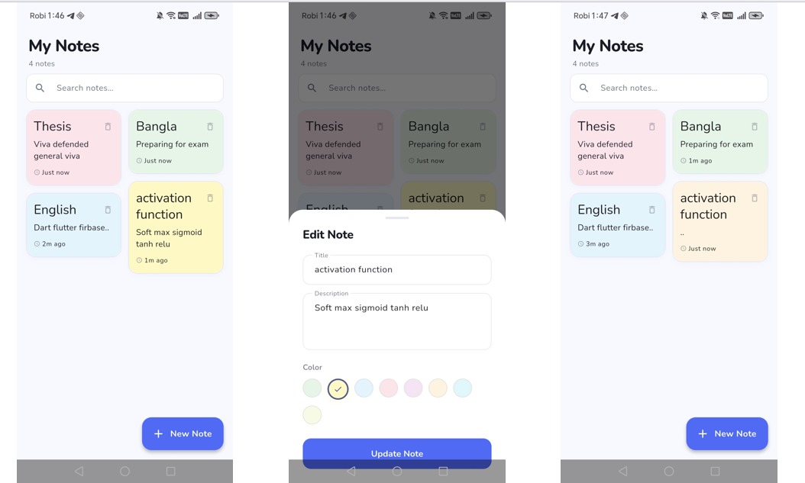
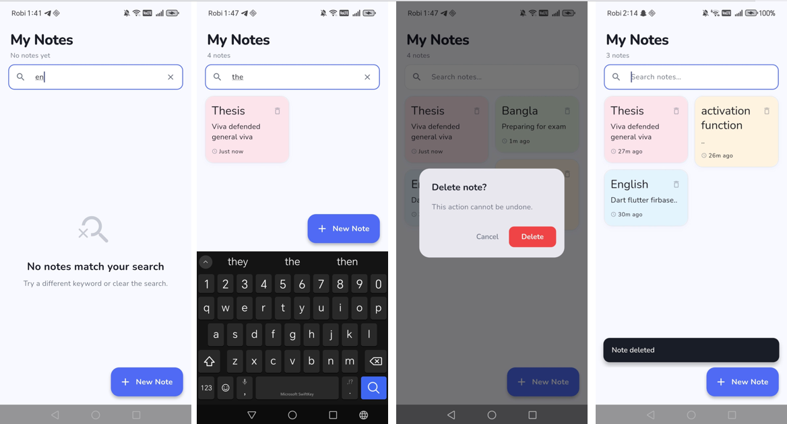

# Notes Management App

A modern, responsive **Notes Management Application** built with **Flutter and Firebase Firestore**, featuring real-time synchronization, clean UI, and full CRUD functionality.


## Features
- **Clean UI/UX:** Material 3 design with soft color palettes and subtle animations.
- **Masonry Grid Layout:** Notes are dynamically sized and presented in a staggered grid.
- **Real-time Sync:** Powered by Cloud Firestore to instantly sync across devices.
- **Instant Search:** Client-side filtering as you type for immediate results.
- **Color Customization:** Assign different colors to notes from a curated palette.

## Tech Stack
- **Framework:** Flutter
- **State Management:** Provider (ChangeNotifier)
- **Database:** Cloud Firestore (Firebase)
- **Fonts:** Google Fonts (Nunito)
- **UI Grid:** flutter_staggered_grid_view

## Folder Structure

```text
notes_management_app/
├── lib/
│   ├── main.dart            # Firebase init, Provider, AppTheme, NotesListScreen
│   ├── models/              # NoteModel
│   ├── services/            # FirestoreService (CRUD operations)
│   ├── providers/           # NotesProvider (State management, search)
│   ├── theme/               # AppColors, AppTheme (Material 3)
│   ├── screens/             # NotesListScreen
│   ├── widgets/
│   │   ├── common/          # ConfirmDeleteDialog
│   │   ├── notes_list/      # NoteCard, NotesSearchBar, EmptyNotesView, NotesListLoading
│   │   └── add_edit/        # NoteFormField, ColorPickerRow, SaveButton
│   └── utils/               # Constants, AppMotion, NoteColors, DateTimeHelper
```

## Firestore Schema

**Collection:** `notes` (root-level collection)

Each document follows this structure:
```json
{
  "title": "string",
  "description": "string",
  "colorValue": 4293457385, // ARGB int (Color.value)
  "createdAt": Timestamp,
  "updatedAt": Timestamp
}
```
- Document ID is auto-generated by Firestore.
- Data is always queried `orderBy('createdAt', descending: true)` to show the newest notes first.

## 📱 App Screenshots


### 🟦 Notes Creation Flow  
Demonstrates the complete note creation process — starting from an empty state, creating a new note with title, description, and color selection, and ending with the note successfully displayed on the home screen.

<p align="center">
  
</p>


### 🟩 Edit & Update Flow  
Demonstrates how users view multiple notes, edit existing notes, and see real-time updates reflected in the home screen after modifications.

<p align="center">
  
</p>


### 🟥 Search & Delete Flow  
Shows search functionality with no-result and match states, along with secure delete confirmation and user feedback using snackbar notifications.

<p align="center">
  
</p>

## How to Run

1. **Clone the repository:**
   ```bash
   git clone https://github.com/jannatulferdous2730/notes_management_app.git
   ```

   ```bash
   cd notes_management_app
   ```
2. **Install dependencies:**
   ```bash
   flutter pub get
   ```
3. **Configure Firebase (if not already done):**
   Make sure you have the Firebase CLI installed and run:
   ```bash
   flutterfire configure
   ```
   This will generate the `firebase_options.dart` file and link your project to a Firebase backend.
4. **Run the app:**
   ```bash
   flutter run
   ```
